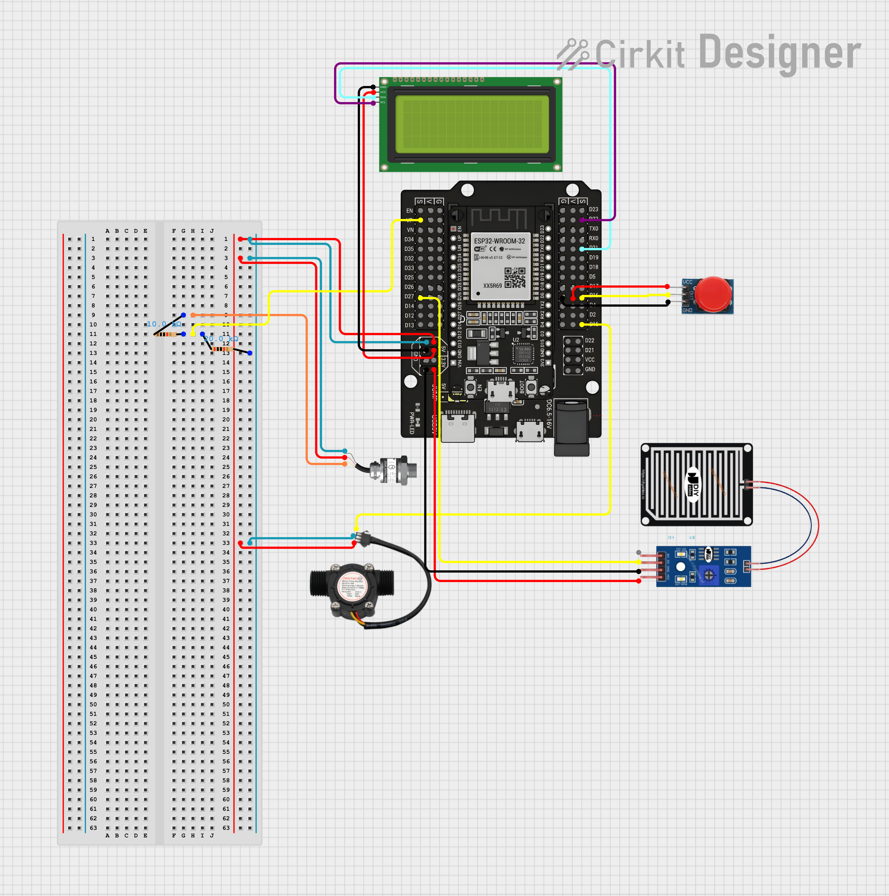
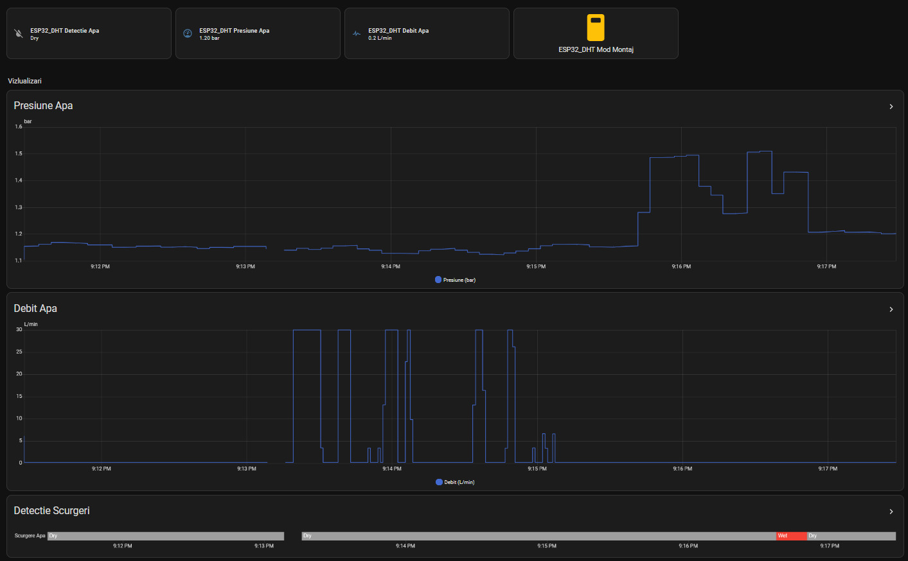

# Smart Water Monitor

An IoT module for monitoring a home water system: flow rate, line pressure, and leak detection,
built on an ESP32 running [ESPHome](https://esphome.io), with local LCD feedback and integration
into a home automation dashboard (Home Assistant).

---

## 1. Overview

The system monitors three parameters of a home water installation in real time:

- **Water flow rate** (L/min)
- **Line pressure** (bar)
- **Water presence / leak detection**

Data is read by an **ESP32** microcontroller, processed locally, shown on a **16x2 LCD display**,
and published to **Home Assistant** (web dashboard), where it can also be logged historically
(e.g. InfluxDB).

## 2. General solution architecture

```
 SENSORS                     ESP32 (processing)            OUTPUTS
 ─────────                   ──────────────────            ──────────────
 Flow sensor (YF-S201)   ──▶  Sensor reading
 Pressure sensor (0-690kPa)  12-bit ADC
 Water sensor (FC-37)        Pulse counting          ──▶   Local LCD display
                              Filtering / processing        Home Assistant dashboard
                              Decision logic                (Wi-Fi + ESPHome API)
                              Threshold alarms

 Power supply: 5V / 3.3V
```

- **What is measured:** water flow (L/min) · line pressure (bar/kPa) · water presence (leaks)
- **Who processes it:** ESP32
- **How it is transmitted:** Wi-Fi → ESPHome API → Home Assistant
- **Where the data ends up:** Home Assistant web dashboard · local LCD display

> Note: an earlier conceptual design considered a modular Sensors → ESP32 → ESP-NOW → Gateway → Master
> layout. The final implementation, described in the code section below, uses a single ESP32 node
> connected directly to Home Assistant over Wi-Fi via the native ESPHome API - a simpler design for a
> single-node prototype.

## 3. Tracked technical parameters

| Measured quantity     | Sensor               | Measurement range           | Estimated accuracy | Sampling | Alarm threshold             |
|------------------------|-----------------------|-------------------------------|----------------------|----------|-------------------------------|
| Water flow             | YF-S201               | 1 – 30 L/min                  | ±3%                  | 1 s      | < 5 L/min or > 20 L/min      |
| Line pressure          | Pressure transducer   | 0 – 690 kPa (0 – 6.9 bar)      | ±2%                  | 500 ms   | < 100 kPa or > 600 kPa        |
| Leak detection         | FC-37 (resistive)     | Present / Absent (digital+analog) | -                | 2 s      | Digital pin LOW/HIGH           |

## 4. Block diagram and operating flow

```
SENSOR READING → FILTERING/PROCESSING → DECISION LOGIC → TRANSMISSION → DISPLAY/ALARM
 (flow,            (moving average,        (compare           (API/Wi-Fi     (local LCD,
  pressure,          unit conversion)        to thresholds)     to HA)        dashboard)
  water presence)
```

**Detailed flow:**

1. **System initialization** - GPIO, ADC, I2C, Wi-Fi setup, data structures.
2. **Flow meter reading** - pulse counting (interrupt / pulse_counter) → L/min calculation.
3. **Pressure reading** - ADC reading (0–4095) → mapped to the 0–6.9 bar range (offset + slope calibration).
4. **Water sensor reading** - digital pin → leak flag set if the sensor indicates water presence.
5. **Decision** - compare values against thresholds → NORMAL / WARNING / CRITICAL state.
6. **Transmission** - flow, pressure, leak, alarm state sent via the ESPHome API → Home Assistant.
7. **Local alarming and display** - LCD display + local log.

## 5. Hardware architecture and component list

| Component              | Model                                                     | Selection rationale |
|--------------------------|------------------------------------------------------------|------------------------|
| Microcontroller           | ESP32 (WROOM-32) - dual-core Xtensa LX6 @ 240 MHz, Wi-Fi 802.11 b/g/n + Bluetooth, 12-bit ADC (18 channels), GPIO/UART/SPI/I2C | Chosen over an Arduino UNO: built-in Wi-Fi/ESP-NOW (Arduino needs an external shield), 12-bit ADC (vs. 10-bit), higher processing power, similar cost. Powered via a barrel jack, mounted on a breakout board. |
| Flow sensor               | YF-S201 - range 1–30 L/min, Hall pulse output, 5V DC, K-factor 7.5 pulses/L | Hall-effect sensor, water-resistant, no electrical contact with the liquid. Chosen over a rotameter (electrical/digital) or an ultrasonic flow meter (expensive, complex). |
| Pressure sensor           | 1/8 NPT Stainless Steel Pressure Transducer (100 PSI) - range 0–690 kPa, 0.5–4.5V analog output, ±2.5% accuracy, -40…+120°C | The 0–100 PSI range suits a domestic boiler/water heater application. |
| Water leak sensor         | FC-37 - resistive, digital + analog output, 3.3–5V, detects at ≥ 2mm water depth | Chosen over capacitive sensors (more expensive/complex) or mechanical floats (moving parts, wear). Provides fast, low-cost leak detection. |



## 6. Software architecture - functional blocks

1. **Initialization** - GPIO / 12-bit ADC config, data structure init, flow meter interrupt setup, threshold config load.
2. **Data acquisition** - ISR pulse counting per second, ADC read 10x → average, digital read of the water sensor.
3. **Processing** - pulse → L/min conversion, ADC → kPa/bar conversion, trend detection, cumulative consumption, threshold comparison, system state determination.
4. **Communication** - payload serialization, transmission to Home Assistant, retry on failure, transmission error logging.
5. **Alarming** - detection timestamp, alarm reset on return to normal, local/InfluxDB logging.
6. **User interface** - Home Assistant dashboard, LCD display, threshold configuration.

### Software logic diagram

```
START/RESET → Initialization (Wi-Fi, GPIO, ADC, I2C)
            → Read sensors (flow + pressure + water presence)
            → Filtering & unit conversion
            → Do values exceed thresholds?
                 YES → Trigger alarm
                 (always) → Transmit via API, update dashboard + local LCD
            → Log (InfluxDB) → Wait 1s → LOOP
```

## 7. Code / configuration (ESPHome)

The full logic is implemented as a single [ESPHome](https://esphome.io) configuration —
see [`esphome/smart-water-monitor.yaml`](esphome/smart-water-monitor.yaml).

| Block | What it does |
|---|---|
| **Pressure sensor** (`sensor: adc`, GPIO36) | Reads voltage via the 12-bit ADC, 12dB attenuation (extends the range to ~3.1V for the resistive divider), 5-sample moving average, resistive-divider correction R1=10kΩ/R2=20kΩ (`×1.5`), calibration formula `((x - 0.72) * 24.81 * 0.0689476) + 1.433`, clamped to 0–7.9 bar, alarms below 1.0 bar / above 6.0 bar (disabled in mounting mode). |
| **Flow sensor** (`sensor: pulse_counter`, GPIO15) | Counts Hall pulses generated by the YF-S201 flow meter rotor (`INPUT_PULLUP`), applies the inverse datasheet formula `Q = (Hz + 3) / 18` to get L/min, alarms below 5 L/min / above 20 L/min. |
| **Leak sensor** (`binary_sensor: gpio`, GPIO27) | Simple digital reading, inverted logic (active LOW), `device_class: moisture`, debounced via `delayed_on: 500ms` / `delayed_off: 1000ms`. |
| **Mounting-mode button** (`binary_sensor: gpio`, GPIO16) | Software debounce (`delayed_on: 50ms`), requires 3 consecutive presses within 2 seconds to toggle mounting mode (`switch.template`), state persisted (`RESTORE_DEFAULT_OFF`). |
| **16x2 LCD display** (`display: lcd_pcf8574`, I2C SDA=GPIO21/SCL=GPIO22, 0x27) | Refreshes every 200ms; displays, in priority order: press progress → mounting mode (pressure+flow) → leak alert → pressure warning → flow warning → normal operation. |

The full YAML file merges all the blocks above into a single working configuration, adding the
standard ESPHome sections (`esphome`, `esp32`, `wifi`, `api`, `ota`, `logger`) required to compile
and integrate with Home Assistant.

## 8. Web interface

Data is automatically exposed by ESPHome to Home Assistant, where a dashboard (Lovelace) can be
built showing the history of flow, pressure, and leak state.



---

## Repository structure

```
smart-water-monitor/
├── README.md
├── LICENSE
├── .gitignore
└── esphome/
    ├── smart-water-monitor.yaml     # full ESPHome configuration
    └── secrets.yaml.example         # template for credentials (Wi-Fi, API, OTA)
└── docs/
    └── images/
        ├── hardware-diagram.png
        └── web-dashboard.jpeg
```

## Usage

1. Install [ESPHome](https://esphome.io/guides/installing_esphome.html) (`pip install esphome`, or the Home Assistant add-on).
2. Copy `esphome/secrets.yaml.example` to `esphome/secrets.yaml` and fill in your own Wi-Fi credentials.
3. Check the pin mapping (GPIO15, GPIO16, GPIO21/22, GPIO27, GPIO36) against your own hardware wiring.
4. Compile and flash the board:
   ```bash
   esphome run esphome/smart-water-monitor.yaml
   ```
5. Add the device in Home Assistant (it will be auto-discovered via the ESPHome API).
